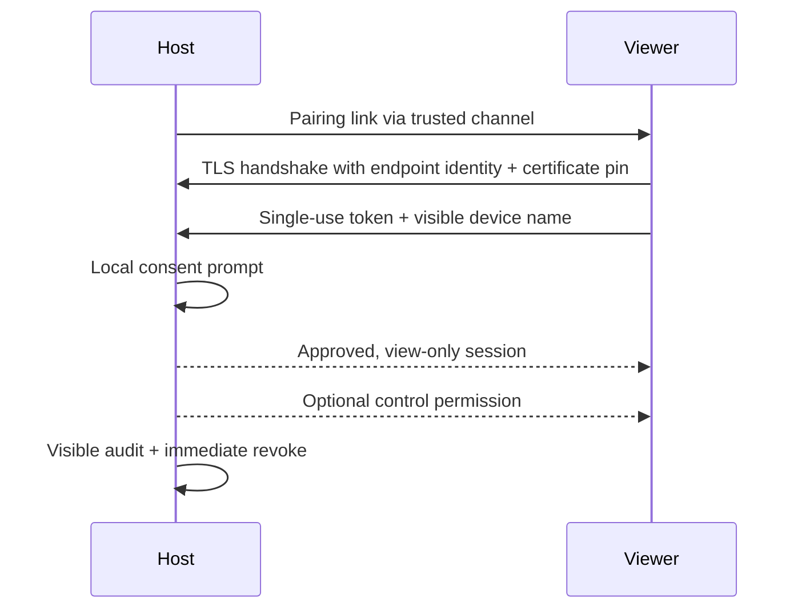

# JDoor Assist

Consent-first, encrypted remote assistance for trusted local networks.

[Official website](https://ejupi-djenis30.github.io/JDoor/) ·
[Source](https://github.com/ejupi-djenis30/JDoor) ·
[Security policy](SECURITY.md)

[](https://github.com/ejupi-djenis30/JDoor/actions/workflows/ci.yml)
[](https://github.com/ejupi-djenis30/JDoor/actions/workflows/codeql.yml)
[](https://adoptium.net/)
[](LICENSE)

JDoor began as a 2022 school networking project built by two student collaborators. Version
1.0.0 is a safety-focused modernization: the unauthenticated “backdoor” prototype was replaced
by an explicit remote-support product with a visible host, local approval, encrypted transport,
bounded messages and remote control disabled by default.

> JDoor Assist is for authorized support only. It deliberately has no unattended access,
> persistence, remote shell, file transfer, webcam capture, privilege escalation, or stealth mode.

## What works

- Direct screen sharing over TLS 1.2/1.3.
- Ephemeral ECDSA certificate for every host run, bound to the advertised host through a SAN.
- Certificate fingerprint embedded in the out-of-band pairing link.
- Client endpoint identification plus constant-time matching of the exact certificate fingerprint.
- Random 128-bit, single-use pairing token with a 10-minute lifetime.
- Local approval showing the viewer name, address, and verification code.
- View-only sessions by default; the host can enable or revoke input instantly.
- Bounded, versioned binary protocol with defensive parsing, pre-TLS per-address caps, and an
  absolute setup deadline.
- Session-scoped control permission and capture cleanup that cannot migrate to a later viewer.
- Daily local JSONL audit records without pairing secrets, capped at 5 MiB with 30-day retention.
- Modern Swing UI with HiDPI support and keyboard-accessible controls.

## Run it

Prerequisites: JDK 21. The Maven Wrapper downloads the pinned Maven distribution.

```bash
./mvnw clean verify
java -jar target/jdoor-assist-1.0.0-all.jar
```

On Windows:

```powershell
.\mvnw.cmd clean verify
java -jar target\jdoor-assist-1.0.0-all.jar
```

From the launcher:

1. The person receiving help chooses **Share this screen**.
2. They copy the one-time `jdoor://` link through a trusted channel.
3. The helper chooses **Join a session**, pastes the link, and requests access.
4. Both devices show the verification code before approval; the host compares it and approves
   locally.
5. The session starts view-only. The host may enable mouse and keyboard control.
6. Either side can end the session; the host can revoke control at any time.

The CLI can open either role directly:

```text
java -jar target/jdoor-assist-1.0.0-all.jar --host --port 8443
java -jar target/jdoor-assist-1.0.0-all.jar --host --advertise 192.168.1.50
java -jar target/jdoor-assist-1.0.0-all.jar --join "jdoor://…"
java -jar target/jdoor-assist-1.0.0-all.jar --help
```

## Security model



The direct connection is intended for a trusted LAN. JDoor Assist does not include a public
relay, NAT traversal, account system, or centralized trust service. Do not expose port 8443
directly to the internet. See [the threat model](docs/THREAT_MODEL.md) and
[security policy](SECURITY.md) before deploying it in a sensitive environment.

## Build and package

`mvn verify` compiles with `-Xlint:all -Werror`, runs unit and real loopback TLS integration
tests, creates a coverage report, builds the shaded JAR, and produces a CycloneDX SBOM.

Create an unsigned platform app image with JDK `jpackage`:

```powershell
.\scripts\package.ps1
```

```bash
./scripts/package.sh
```

Outputs are written below `target/package/`. Community builds are currently unsigned; your OS
may show an unverified-publisher warning. Release automation also emits checksums, an SBOM, and
GitHub build provenance. Maintainers should follow the
[release procedure](docs/RELEASES.md); a successful packaging run alone does not authorize a
publication.

## Repository map

```text
src/main/java/com/jdoor/
├── audit/       local, secret-free security events
├── capture/     bounded JPEG screen capture
├── cli/         headless-safe command parsing
├── control/     policy-gated AWT input
├── protocol/    versioned and size-limited wire format
├── security/    ephemeral TLS identity, pinning, pairing token
├── session/     host/viewer lifecycle and consent boundary
└── ui/          launcher, host, and viewer desktop surfaces
```

Further reading:

- [Architecture](docs/ARCHITECTURE.md)
- [Threat model](docs/THREAT_MODEL.md)
- [Privacy](docs/PRIVACY.md)
- [Development guide](docs/DEVELOPMENT.md)
- [Release procedure](docs/RELEASES.md)
- [Contributing](CONTRIBUTING.md)
- [Changelog](CHANGELOG.md)

## License and attribution

JDoor remains licensed under [GNU GPL v3](LICENSE). The original school project and its Git
history are preserved to credit both collaborators. Portfolio material distinguishes that shared
2022 work from the later product, security, UX, testing and release modernization.
